<div style="position: sticky; top: 0; left: 0; width: 100%; background-color: rgba(255, 255, 255, 1); padding: 10px; border-bottom: 1px solid #ccc; z-index: 999;">
    <a href="README.md">Inicio</a> |<>|
    <a href="ServidorDesarrollo.md">Servidor de desarrollo</a> |<>|
    <a href="GitHub.md">GitHub</a> |<>|
    <a href="EntornoExplotacion.md">Entorno de explotación</a>
</div>
<hr>

<!-- title: README -->
# CLIENTE DE DESARROLLO - WINDOWS 10/11

|  CFGS DESARROLLO  DE APLICACIONES WEB |
|:-----------:|
||
| DESPLIEGUE DE APLICACIONES WEB
| CYBERSEGURIDAD
| DAWES Tema 2. INSTALACIÓN, CONFIGURACIÓN Y DOCUMENTACIÓN DE ENTORNO DE DESARROLLO Y DEL ENTORNO DE EXPLOTACIÓN |


- [CLIENTE DE DESARROLLO - WINDOWS 10/11](#cliente-de-desarrollo---windows-1011)
  - [**1 Configuración inicial**](#1-configuración-inicial)
    - [*Nombre y configuración de red*](#nombre-y-configuración-de-red)
    - [*Cuentas administradoras*](#cuentas-administradoras)
  - [**2 Navegadores**](#2-navegadores)
  - [**3 MobaXterm**](#3-mobaxterm)
    - [*Instalación*](#instalación)
    - [*Configuración*](#configuración)
    - [*Ejemplo de uso*](#ejemplo-de-uso)
      - [**Conexion SSH**](#conexion-ssh)
      - [**Conexión SFTP**](#conexión-sftp)
  - [**4 Netbeans**](#4-netbeans)
    - [*Instalación*](#instalación-1)
    - [*Configuración*](#configuración-1)
    - [*Ejemplo de uso*](#ejemplo-de-uso-1)
  - [**5 Visual Studio Code**](#5-visual-studio-code)
    - [*Instalación*](#instalación-2)
    - [*Configuración*](#configuración-2)
    - [*Ejemplo de uso*](#ejemplo-de-uso-2)
      - [**Abrir proyecto**](#abrir-proyecto)
      - [**Depurar con Xdebug**](#depurar-con-xdebug)
      - [**Conexión SFTP y SSH al servidor**](#conexión-sftp-y-ssh-al-servidor)
      - [**Conectar a base de datos**](#conectar-a-base-de-datos)
      - [**Uso de Git y GitHub**](#uso-de-git-y-github)


## <h2>**1 Configuración inicial**</h2>

### <h2>*Nombre y configuración de red*</h2>

### <h2>*Cuentas administradoras*</h2>

## <h2>**2 Navegadores**</h2>

## <h2>**3 MobaXterm**</h2>

### <h2>*Instalación*</h2>
https://mobaxterm.mobatek.net/download-home-edition.html

Lo descargamos de la página oficial, tenemos dos versiones, una portable y otra para instalar, yo uso la portable.

Una vez descargada, la descomprimimos donde no moleste, entramos y ejecutamos *MobaXterm_Personal_25.3.exe*.

### <h2>*Configuración*</h2>

### <h2>*Ejemplo de uso*</h2>

#### **<h3>Conexion SSH</h3>**
Damos al icono de *Session* arriba a la izquierda, elegimos SSH y configuramos ip y nombre de usuario.

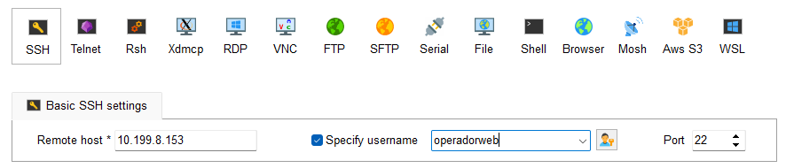

Le damos a OK y nos pedirá la contraseña para conectarse.

Si es la primera vez que configuramos una sesión no ssaldrá otra ventana para guardar las contraseñas, si aceptamos nos pedira que pongamos una contraseña general para el programa, si no aceptamos tendremos que poner la contraseña cada vez que nos conectemos.

Nos conectamos seleccionando en la lista de *User sessions* y se abrirá una consola lista con nuestro usuario para poner comandos
````Bash
miadmin@gjl-used:~$
````

#### **<h3>Conexión SFTP</h3>**
Damos al icono de *Session* arriba a la izquierda, elegimos SFTP y configuramos ip y nombre de usuario.
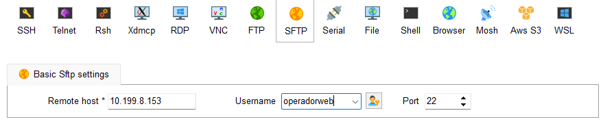

Le damos a OK y nos pedirá la contraseña para conectarse.

Una vez configurado saldra en la lista de *User sessions* para poder usarlas.

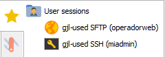

Lo seleccionamos en la lista y se abrirá una ventana con la parte local a la izquierda para buscar los archivos que queremos subir y la parte del servidor a la derecha donde tenemos iconos para ir **arriba**, **actualizar**, **crear carpetas**, **crear archivos**, **abrir carpeta**, **borrar elementos**, **subir archivo** (se abre el explorador de windows para elegir un archivo), **descargar archivo** (seleccionamos un archivo, le damos al boton y se abre el explorador de windows para elegir donde guardarlo) y la barra que indica la ruta donde estamos.

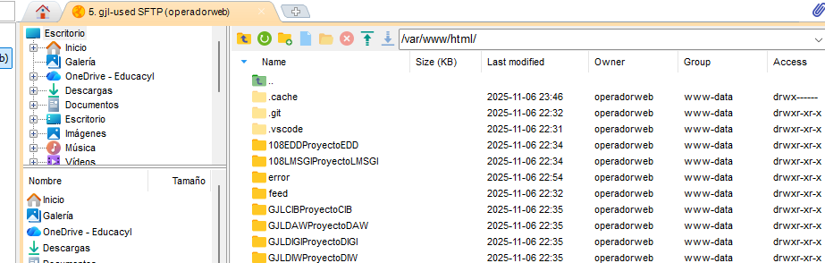

También podemos abrir cualquier archivo de texto, html, php, etc (con doble click) con el editor de texto de MobaXterm por si tenemos que hacer alguna modificación menor o ver el código.

## <h2>**4 Netbeans**</h2>

### <h2>*Instalación*</h2>
Apache NetBeans IDE 20

### <h2>*Configuración*</h2>
- configurar carpetas por defecto, cambiar las rutas

### <h2>*Ejemplo de uso*</h2>
- version y plugins de netbeans (las que esten por defecto, donde se ve)
- como usar github
- como llevar a casa y volver a usar aquí (es github)
- capturas solo de la parte ineteresada, no de toda la pantalla

**<h3>Crear proyecto con conexion (SFTP) al servidor</h3>**
- Nuevo proyecto PHP marcando la opción "PHP Application from Remote Server"

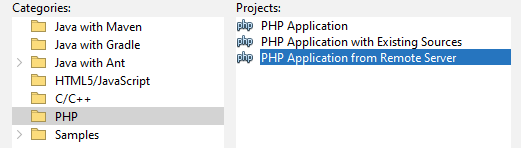
- Ponemos nombre de proyecto y cambiamos la ruta por la nuestra personal

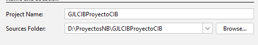
- Configuramos la url con nuestro servidor y el nombre del proyecto en el servidor, en el caso del proyecto principal no tiene carpeta es la raíz (/)

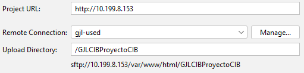
- La primera vez que creamos un proyecto con conexión al servidor hay que configurarlo con nombre de usuario, contraseña y directorio inicial

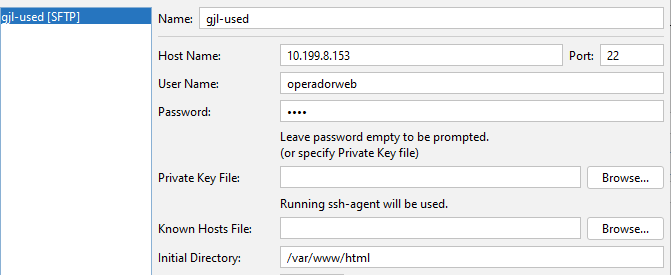
- Si todo ha ido bien se conectará al servidor y entrará en la carpeta del proyecto que previamente tenemos que haber creado y que haya por lo menos un archivo en ella. Aquí ya marcamos para que se bajen los archivos que queramos.

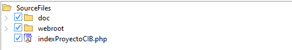

**<h3>Borrar proyecto con conexion (SFTP) al servidor</h3>**
- botón secundario sobre el proyecto y delete. Nos pedirá confirmación y si queremos que borre los archivos en nuestro ordenador. Los del servidor lo tenemos que borrar a mano.

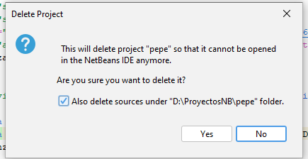


## <h2>**5 Visual Studio Code**</h2>

### <h2>*Instalación*</h2>
https://code.visualstudio.com/

En la pagina oficial le damos a *Download for Windows* para descargar la última version disponible. 
Abrimos el ejecutable y todo siguiente, siguiente y terminar.

### <h2>*Configuración*</h2>

**<h3>Cambiar idioma a español</h3>**
https://marketplace.visualstudio.com/items?itemName=MS-CEINTL.vscode-language-pack-es

Instalamos esa extensión y le damos a "change languaje and restart" en la ventana emergente que sale abajop a la derecha.

**<h3>Auto Close Tag (Extensión)</h3>**
https://marketplace.visualstudio.com/items?itemName=formulahendry.auto-close-tag

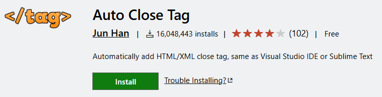

**<h3>Conventional Commits (Extensión)</h3>**
https://marketplace.visualstudio.com/items?itemName=vivaxy.vscode-conventional-commits

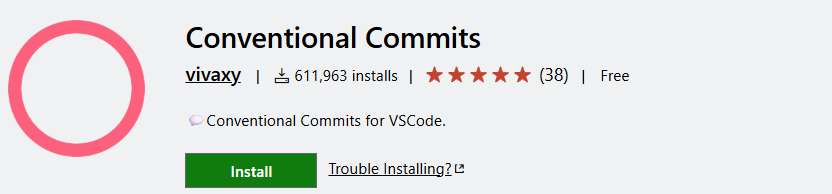

**<h3>Git Graph (Extensión)</h3>**
https://marketplace.visualstudio.com/items?itemName=mhutchie.git-graph

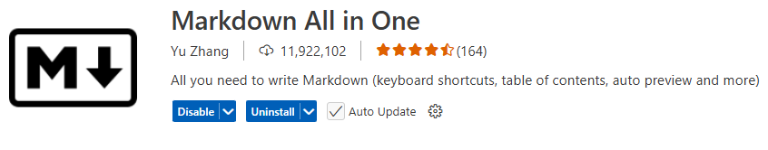

**<h3>Live Server (Extensión)</h3>**
https://marketplace.visualstudio.com/items?itemName=ritwickdey.LiveServer

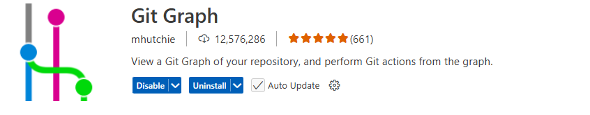

**<h3>Markdown All in One (Extensión)</h3>**
https://marketplace.visualstudio.com/items?itemName=yzhang.markdown-all-in-one

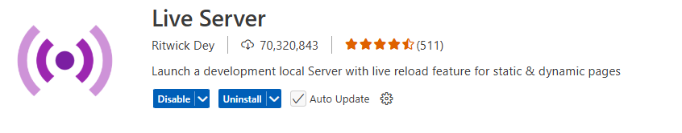

**<h3>PHP Extension Pack (Extensión)</h3>**
https://marketplace.visualstudio.com/items?itemName=xdebug.php-pack&ssr=false#overview

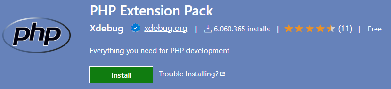

Esta extensión instala otras dos, la PHP IntelliSense

https://marketplace.visualstudio.com/items?itemName=zobo.php-intellisense

y PHP Debug

https://marketplace.visualstudio.com/items?itemName=xdebug.php-debug

**<h3>PHP Intelephense (Extensión)</h3>**
https://marketplace.visualstudio.com/items?itemName=bmewburn.vscode-intelephense-client

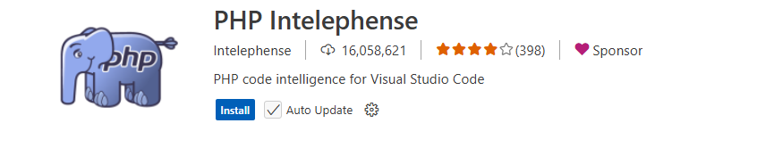

Para que funcione hay deshabilitar la que viene por defecto, buscamos @builtin php en el buscador de extensiones y la desactivamos.


**<h3>SFTP (Extensión)</h3>**
https://marketplace.visualstudio.com/items?itemName=Natizyskunk.sftp


**<h3>SQLTools (Extensión)</h3>**
https://marketplace.visualstudio.com/items?itemName=mtxr.sqltools

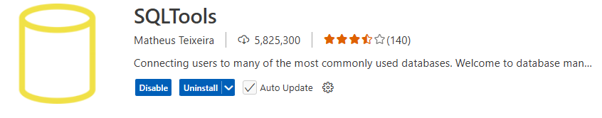

**<h3>SQLTools MySQL/MariaDB/TiDB (Extensión)</h3>**
https://marketplace.visualstudio.com/items?itemName=mtxr.sqltools-driver-mysql


**<h3>vscode-pdf (Extensión)</h3>**
https://marketplace.visualstudio.com/items?itemName=tomoki1207.pdf


### <h2>*Ejemplo de uso*</h2>

#### **<h3>Abrir proyecto</h3>**
En vsCode no tenemos el concepto de proyecto como tal, lo que hacemos es abrir la carpeta donde tenemos los archivos.

Primero, si estamos trabajando en algun proyecto ya y queremos abrir otro, lo que hacemos es abrir nueva ventana en archivos(File)

Para abrir una carpeta vamos a archivos(File) y a abrir carpeta(open folder), se abrirá el explorador de archivos y buscamos la carpeta del proyecto.

Otra opción que tenemos para abrir proyectos recientes rápidamente es desde la ventana principal que aparecen los ultimos 5 proyectos que hemos abierto y si damos a más podemos abrir practicamente cualquier proyecto anterior.

#### **<h3>Depurar con Xdebug</h3>**
Para poder depurar necesitamos tener instalada la extensión [PHP Extension Pack](https://marketplace.visualstudio.com/items?itemName=xdebug.php-pack&ssr=false#overview) la cual instala la extensión PHP Debug que necesitamos.

En nuestro caso por la configuración de nuestro ubuntu server tenemos que cambiar el identificador del ide que usamos, para ello hay que ir a la configuración y buscar "php.debug.idekey" y ponerle el valor "netbeans-xdebug".

Le damos a la pestaña de depuración  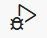 y damos en "*create a launch.json file*", esto creara un archivo de configuración (launch.json) en la carpeta .vscode.

Abrimos el archivo launch.json y añadimos la ruta de nuestro proyecto en "pathMappings". 

````Bash
{
    "name": "Listen for Xdebug",
    "type": "php",
    "request": "launch",
    "port": 9003,
    "pathMappings": {
        "/var/www/html/GJLDWESProyectoTema4": "${workspaceRoot}"
    }
},
````
>Es importante saber que para que funcione esta forma de hacerlo tenemos que abrir solo nuestro proyecto GJLDWESProyectoTema4 en una ventana de visual studio code, no añadir varios proyectos a un Workspace. Si necesitamos abrir varios proyectos a la vez podemos abrir todas las ventanas que queramos de File>New Window.

Para empezar a depurar tenemos que añadir un punto de parada al lado de la linea de código dónde queramos que pause la ejecución, se hace poniendo un punto rojo a la izquierda del número de línea.

Vamos a la pestaña de depuración, en el desplegable ponemos listen for Xdebug y le damos al play verde. Vamos al navegador, abrimos la página para que cargue y empiece a depurar (en el navegador se quedara cargando y si tardamos mucho puede que salga un error de TimeOut)

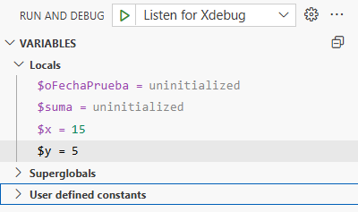

En variables nos saldrán todas las variables locales que se hayan cargado antes del punto de parada que pusimos y tambien podemos ver las Superglobales y las constantes. 

Aparecerá una barra con botones para controlar la ejecución de la depuración

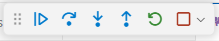

En el codigo resaltará en amarillo por donde va la ejecución del codigo, en esta prueba esta en el punto que había puesto al principio.

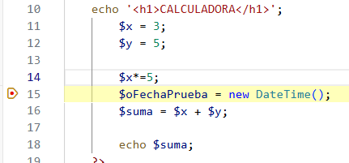

Para finalizar ejecutamos hasta que acabe el codigo o le damos al cuadrado rojo en la barra de botones.


#### **<h3>Conexión SFTP y SSH al servidor</h3>**
Para conectarnos a nuestro servidor por sftp tenemos que instalar la extensión [SFTP](https://marketplace.visualstudio.com/items?itemName=Natizyskunk.sftp). Damos a F1, buscamos *SFTP: Config* y le damos. Ésto creará un archivo *sftp.json* en la carpeta .vscode donde configurar los datos de nuestra conexión:
````Bash
{
    "name": "gjl-used",
    "host": "10.199.8.153", # esto lo cambiamos en casa y en clase
    "protocol": "sftp",
    "port": 22,
    "username": "operadorweb",
    "remotePath": "/var/www/html/GJLDWESProyectoTema4", # con ruta relativa no siempre funciona
    "password": "paso",
    "uploadOnSave": true, # para que se suba al guardar el archivo o al hacer cualquier cambio
    "useTempFile": false,
    "openSsh": false
}
````
>La contraseña no viene por defecto, lo que hace es pedir que pongamos la contraseña que cada vez que nos conectamos, para evitar que la pida cada x tiempo la ponemos en el archivo de configuración.  

También crea una pestaña 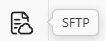 para administrar los archivos directamente en el servidor, al darle se abre el *SFTP:EXPLORER* donde vemos lo que tenemos subirdo al servidor y si hacemos clicke derecho sobre él vemos algunas opciones.

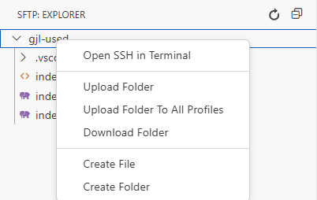

**Open SSH in Terminal:** es para abrir una consola de nuestro servidor conectándonos con nuestro usuario operadorweb en este caso, en caso de que el usuario no tenga permisos nos dará error.

**Upload Folder:** es para subir todos los archivos en local al servidor o solo los que falten, hay que darle al botón de actualizar para ver los cambios.

Si damos boton secundario sobre un archivo o carpeta podemos borrarla con *delete*.

Por último si vamos al explorador de nuestro proyecto en local y damos click derecho sobre cualquier archivo o carpeta abrán aparecido tres opciones más que son *Upload File*, *Upload File to All profiles* y *Download File*, nos interesa sobre todo el primero para subir cualquier archivo de forma manual sin esperar a que se suba solo cuando guardemos.

#### **<h3>Conectar a base de datos</h3>**
Primero tenemos que instalar las extensiones [SQLTools](https://marketplace.visualstudio.com/items?itemName=mtxr.sqltools) y [SQLTools MySQL/MariaDB/TiDB Driver](https://marketplace.visualstudio.com/items?itemName=mtxr.sqltools-driver-mysql). Nos aparecerá una nueva pestaña a la izquierda para controlar la base detos 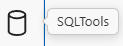.

Abrimos esa pestaña, damos a Añadir nueva conexión y elegimos MariaDB.

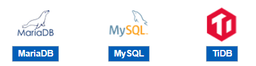

y configuramos los datos de nuestro servidor (* son obligatorios) , usuario, contraseña y la base datos.
````Bash
Connection name*: gjl-used
Connect using*: Server and Port
Server Address*: 10.199.8.153 # hay que cambiarlo entre clase y casa
Port*: 3306
Database*: mysql
Username*: adminsql
Password mode: Save as plaintext in settings # válido para hacer pruebas, en trabajo 
# real dejaría Ask on Connect para que me pida siempre la contraseña
Password*: paso
````
Damos a SAVE CONNECTION, creará un archivo settings.json en la carpeta .vscode con los datos de nuestra conexión, ahí podemos cambiar la ip de clase por la de casa. Además en la pestaña de base de datos crea una nueva entrada.

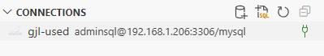

Para conectarnos y poder administrar la base de datos le damos al icono verde. Al hacerlo ya nnos saldrán todas las bases de datos con sus tablas, vistas, etc. 
Cuando abrimos un archivo .sql vemos una opcion arriba para ejecutar todo el codigo SQL (Run on active connection) o si tenemos muchas instrucciones y solo queremos ejecutar alguna, la seleccionamos y con boton derecho sobre ella damos a *Run Selected Query*.

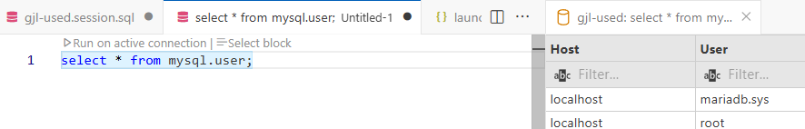

Si se ejecuta bien aparece una pestaña a la derecha con el resultado.

#### **<h3>Uso de Git y GitHub</h3>**
Toda esta sección lo tengo documentado
<a href="GitHub.md#instalación" target="_blank">aquí</a>.


> **Gonzalo Junquera Lorenzo**  
> Curso: 2025/2026  
> 2º Curso CFGS Desarrollo de Aplicaciones Web  

