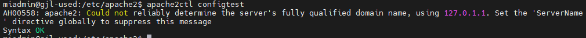
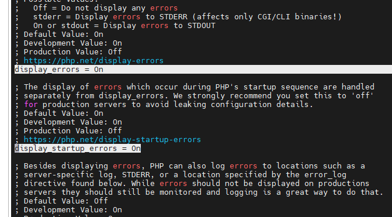
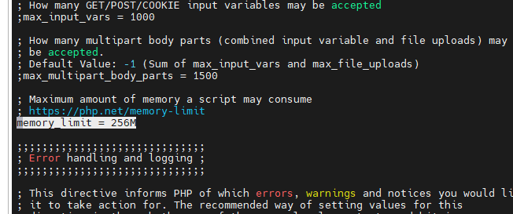
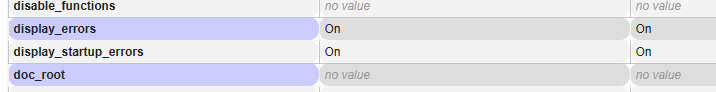
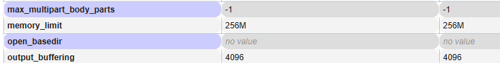
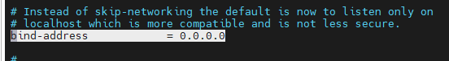
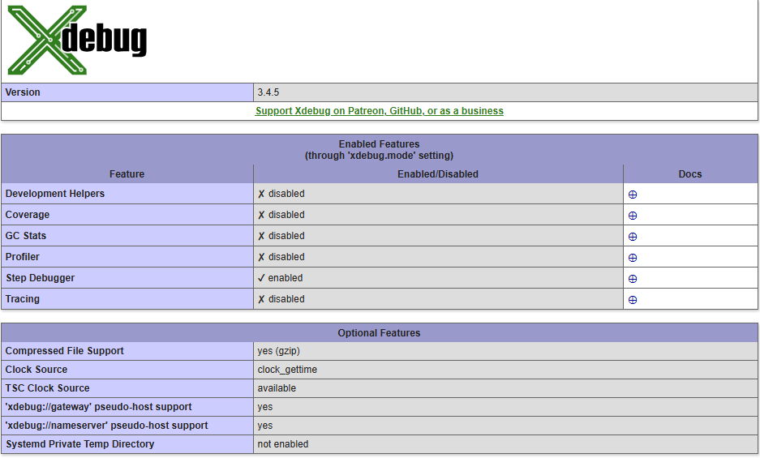
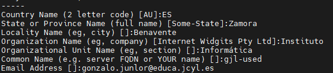
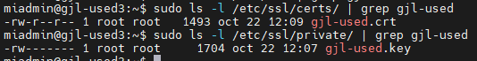
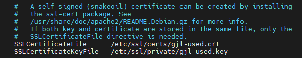

<!-- title: README -->
# CFGS Desarrollo de Aplicaciones Web

|  CFGS DESARROLLO  DE APLICACIONES WEB |
|:-----------:|
||
| DESPLIEGUE DE APLICACIONES WEB
| CYBERSEGURIDAD
| DAWES Tema 2. INSTALACIÓN, CONFIGURACIÓN Y DOCUMENTACIÓN DE ENTORNO DE DESARROLLO Y DEL ENTORNO DE EXPLOTACIÓN |


- [CFGS Desarrollo de Aplicaciones Web](#cfgs-desarrollo-de-aplicaciones-web)
  - [1. Entorno de Desarrollo](#1-entorno-de-desarrollo)
    - [1.1 Ubuntu Server 24.04.3 LTS](#11-ubuntu-server-24043-lts)
      - [1.1.1 **Configuración inicial**](#111-configuración-inicial)
        - [**Comprobaciones sistema operativo**](#comprobaciones-sistema-operativo)
        - [**Cambiar nombre servidor**](#cambiar-nombre-servidor)
        - [**Actualizar el sistema**](#actualizar-el-sistema)
        - [**Configuración fecha y hora**](#configuración-fecha-y-hora)
        - [**Antivirus**](#antivirus)
        - [**Cuentas administradoras**](#cuentas-administradoras)
        - [**Habilitar cortafuegos**](#habilitar-cortafuegos)
        - [**Conexión al servidor desde windows**](#conexión-al-servidor-desde-windows)
        - [**Comprobar ip, puerta de enlace y dns**](#comprobar-ip-puerta-de-enlace-y-dns)
        - [**Particiones**](#particiones)
        - [**Actualización**](#actualización)
        - [**Enjaular usuarios**](#enjaular-usuarios)
      - [1.1.2 Instalación del servidor web](#112-instalación-del-servidor-web)
        - [Instalación](#instalación)
        - [Configuración](#configuración)
        - [Monitorización](#monitorización)
        - [Mantenimiento](#mantenimiento)
      - [1.1.3 PHP](#113-php)
        - [Instalación](#instalación-1)
        - [Configuración](#configuración-1)
        - [Monitorización](#monitorización-1)
        - [Mantenimiento](#mantenimiento-1)
      - [1.1.4 MariaDB](#114-mariadb)
        - [Instalación](#instalación-2)
        - [Configuración](#configuración-2)
        - [Monitorización](#monitorización-2)
        - [Mantenimiento](#mantenimiento-2)
      - [1.1.5 Módulos PHP](#115-módulos-php)
        - [php8.3-mysql](#php83-mysql)
        - [php8.3-intl](#php83-intl)
        - [php8.3-xdebug](#php83-xdebug)
        - [DirectoryIndex](#directoryindex)
      - [1.1.6 Servidor web seguro (HTTPS)](#116-servidor-web-seguro-https)
        - [Instalación](#instalación-3)
        - [Configuración](#configuración-3)
        - [Monitorización](#monitorización-3)
        - [Mantenimiento](#mantenimiento-3)
      - [1.1.7 DNS](#117-dns)
      - [1.1.8 SFTP](#118-sftp)
      - [1.1.9 Apache Tomcat](#119-apache-tomcat)
      - [1.1.10 LDAP](#1110-ldap)
      - [1.1.11 phpMyAdmin](#1111-phpmyadmin)
- [Despues de instalar](#despues-de-instalar)
- [Comparamos los dos ficheros (estando en la ruta /home/miadmin/)](#comparamos-los-dos-ficheros-estando-en-la-ruta-homemiadmin)
    - [1.2 XAMP](#12-xamp)

## 1. Entorno de Desarrollo

### 1.1 Ubuntu Server 24.04.3 LTS

Este documento es una guía detallada del proceso de instalación y configuración de un servidor de aplicaciones en Ubuntu Server utilizando Apache, con soporte PHP y MySQL

#### 1.1.1 **Configuración inicial**

##### **Comprobaciones sistema operativo**
- Tipo de sistema operativo
````Bash
uname -a
hostnamectl
````
- Ver procesos
````Bash
ps -ef
````

- Nombre y configuración de red

> **Nombre de la máquina**: gjl-uslimpia\
> **Memoria RAM**: 2G\
> **Particiones**: 150G(/) y resto (/var)\
> **Configuración de red interface**: enp0s3 \
> **Dirección IP** :10.199.8.153/22\
> **GW**: 10.199.8.1/22\
> **DNS**: 10.151.123.21 10.151.126.21

* Creamos una copia del archivo que viene por defecto 50-cloud-init.yml
````Bash
cd /etc/netplan
sudo cp 50-cloud-init.yml enp0s3.yaml
````
- Editar el fichero de configuración del interface de red  **/etc/netplan/enp0s3.yaml**

```bash

# This is the network config written by 'subiquity'
network:
  ethernets:
    enp0s3:
      addresses:
       - 10.199.8.153/22
      nameservers:
         addresses:
         - 10.151.123.21
         - 10.151.126.21
      search: [educa.jcyl.es]
      routes:
        - to: default
           via: 10.199.8.1   
  version: 2
```
- Actualizar la configuración de red
````Bash
sudo netplan apply
````
##### **Cambiar nombre servidor**
````Bash
sudo hostnamectl set-hostname gjl-used
````
- También cambiamos el nombre en ese archivo y comprobamos con cat
````Bash
sudo nano /etc/hosts
cat /etc/hosts
````

##### **Actualizar el sistema**

```bash
sudo apt update
sudo apt upgrade
```

##### **Configuración fecha y hora**

[Establecer fecha, hora y zona horaria](https://somebooks.es/establecer-la-fecha-hora-y-zona-horaria-en-la-terminal-de-ubuntu-20-04-lts/ "Cambiar fecha y hora")
````Bash
sudo timedatectl set-timezone Europe/Madrid
````
##### **Antivirus**
````Bash
sudo apt install clamav
````
Ver versión
````Bash
clamscan --version
````
##### **Cuentas administradoras**

> - [X] root(inicio)
> - [X] miadmin/paso
> - [X] miadmin2/paso

* Para crear el usuario miadmin2 como administrador en los mismos grupos que miadmin, miadmin está creado al instalar ubuntu server. Después le ponemos una contraseña
````Bash
sudo useradd -m -G sudo,adm,cdrom,dip,plugdev,lxd -s /bin/bash miadmin2
sudo passwd miadmin2
````
* Para borrar un usuario
````Bash
sudo userdel miadmin2
````
* Para ver datos de las cuentas
````Bash
cat /etc/passwd
cat /etc/group
````
##### **Habilitar cortafuegos**

- Activar cortafuegos
````Bash
sudo ufw enable
````
- Abrir puerto 22
````Bash
sudo ufw allow 22
````
- Ver puertos abiertos, cualquiera de los dos comandos.
````Bash
sudo ufw status
sudo ufw status numbered 
````
- Quitar número de puerto
````Bash
sudo ufw delete [numPuerto]
````
##### **Conexión al servidor desde windows**
* Arrancamos el servicio ssh en el servidor
````Bash
sudo systemctl start ssh
````
* Comprobamos que esta en active (running)
````Bash
sudo systemctl status ssh
````
* Abrimos la consola de windows (simbolo del sistema): usamos el comando ssh con nuestro nombre de usuario y ip del servidor, despues nos pedirá la clave.
````Bash
ssh miadmin@10.10.199.8.153
````

##### **Comprobar ip, puerta de enlace y dns**
* Para ver la ip, el nombre de nuestro adaptador de red (enp0s3), si es dinámica pondra dynamic en la misma linea, si es estática no pondrá nada.
````Bash
ip a
````
* Para ver la puerta de enlace, en la primera linea pone la puerta de enlace y tambien el nombre de la tarjeta de red
````Bash
ip r
````
* Para ver los dns, en DNS Servers se ve cuales hay configurados, tambien vemos a que dominio pertenecemos en DNS Domain
````Bash
resolvectl
````
##### **Particiones**
* Con ambos comandos vemos que particiones hay y de que tamaño son. El primero da mas información del tamaño usado.
````Bash
df -h
lsblk [-a][-fm][-fn]
fdisk -l
````
##### **Actualización**
* Para comprobar si hay actualizaciones y despues que actualice todo lo necesario
````Bash
sudo apt update
sudo apt upgrade
````

##### **Enjaular usuarios**
Creamos el grupo ftpusers
````Bash
sudo groupadd sftpusers
````

Creamos el usuario usuarioenjaulado1 con carpeta home var/www/usuarioenjaulado1 y le ponemos contraseña
````Bash
sudo useradd -g www-data -G sftpusers -m -d /var/www/usuarioenjaulado1 usuarioenjaulado1
sudo passwd usuarioenjaulado1
````

Cambiamos el propietario y los permisos al home del usuario para que pertenezca al root
````Bash
sudo chown root:root /var/www/usuarioenjaulado1
sudo chmod 555 /var/www/usuarioenjaulado1
````

Creamos una carpeta dentro que será la que el usuarioenjaulado1 puede escribir
````Bash
sudo mkdir /var/www/usuarioenjaulado1/htdocs
sudo chmod 2775 -R /var/www/usuarioenjaulado1/htdocs
sudo chown usuarioenjaulado1:www-data -R /var/www/usuarioenjaulado1/htdocs
````

Copia de seguridad de /etc/ssh/sshd_config.dsudo nano  y lo modificamos con sudo nano
````Bash
# Me ha dado problemas el añadir este código, de momento lo tengo comentado
Subsystem sftp internal-sftp

Match Group sftpusers
ChrootDirectory %h
ForceCommand internal-sftp -u 2
AllowTcpFordwarding yes
PermitTunnel no
X11Forwarding no
````

Reiniciamos ssh
````Bash
sudo systemctl restart ssh
````

#### 1.1.2 Instalación del servidor web

##### Instalación
- Instalamos apache
````Bash
sudo apt update
sudo apt install apache2
````
- Abrir puerto 80, comprobamos y desactivamos el 80(v6)
````Bash
sudo ufw allow 80
sudo ufw status numbered
sudo ufw delete 3
````
##### Configuración
**Permisos y usuarios**
- Creamos usuario del dominio para administrar la web.
  - Nombre: operadorweb/paso
  - directorio de trabajo: /var/www/html 
  - grupo:www-data
  - shell:/bin/bash
  - 
````Bash
sudo useradd -M -d /var/www/html -N -g www-data -s /bin/bash operadorweb
````
- Cambiamos la contraseña (paso)
````Bash
sudo passwd operadorweb
````
- Cambiamos el propietario de la carpeta html y el grupo
````Bash
sudo chown -R operadorweb:www-data /var/www/html
````
- Cambiamos los permisos de la carpeta html
````Bash
sudo chmod -R 775 /var/www/html
````

**Archivos de configuración**

Estan en etc/apache2/
* Redirección de errores a archivo error.log, añadimos la línea CustomLog al archivo 000-default.conf. Previamente hay que tener creada la carpeta error en /var/www/html/
````Bash
sudo nano sites-available/000-default.conf
CustomLog ${APACHE_LOG_DIR}/access.log combined
````
* Quitar aviso al usar el comando apache2ctl configtest.

* añadimos el nombre del servidor al final del archivo de configuración apache2.conf
````Bash
sudo nano /etc/apache2/apache2.conf
ServerName gjl-used
````
* Para poder poner directivas solo a nuestra web lo hacemos con un archivo .htaccess, pero para poder usar este archivo primero tenemos que cambiar la configuracion de apache2.conf

**Errores con htaccess**
Al lado del index general de nuestra aplicación creamos el archivo .htaccess el cual manejará los errores 500, 404 y 403.
* Inicialmente podemos configurar un mensaje de error en este mismo archivo añadiendo esta línea.
````Bash
ErrorDocument 404 "Mensaje de error"
````
* Mejor se hace con enlaces a paginas html de errores que estan en la carpeta error. De momento usamos rutas absolutas desde la raiz de nuestro servidor
````Bash
ErrorDocument 404 /GJLDWESProyectoDWES/error/404.html
ErrorDocument 403 /GJLDWESProyectoDWES/error/403.html
ErrorDocument 500 /GJLDWESProyectoDWES/error/500.html
````

##### Monitorización
- Comprobamos que el servicio esta en ejecucion (running)
````bash
sudo systemctl status apache2
````
- Comprobamos ubicacion de la carpeta y los archivos web
````Bash
cd /var/www/html
ls
````
##### Mantenimiento


#### 1.1.3 PHP
##### Instalación
````Bash
sudo apt install php8.3-fpm php8.3
````
##### Configuración
**Ficheros de configuración de PHP para php-fpm:**
* **/etc/php/8.3/fpm/conf.d**: Módulos instalados en esta configuración de php (enlaces simbólicos a /etc/php/8.3/mods-available)
* **/etc/php/8.3/fpm/php-fpm.conf** : Configuración general de php-fpm
* **/etc/php/8.3/fpm/php.ini** : Configuración de php para este escenario
* **/etc/php/8.3/fpm/pool.d** : Directorio con distintos pool de configuración. Cada aplicación puede tener una configuración distinta (procesos distintos) de php-fpm.

Reiniciar el servicio:
```bash
sudo systemctl restart php8.3-fpm
```

Activamos el módulo de Apache2 con PHP-FPM

```bash
sudo a2enmod proxy_fcgi setenvif
```


**Activarlo para cada virtualhost**
  
Existe un **archivo especial** en `/run/php/php8.3-fpm.sock`que actua como punto de comunicación dentro de la propia máquina en sistemas UNIX/Linux y no usa puertos ni direcciones IP.
 
 Se pone esta expresion en el archivo /etc/apache2/sites-available/000-default.conf
```bash
  ProxyPassMatch ^/(.*\.php)$ unix:/run/php/php8.3-fpm.sock|fcgi://127.0.0.1/var/www/html
```


**Activarlo para todos los virtualhost**

El fichero de configuración `php8.3-fpm`en el directorio `/etc/apache2/conf-available`, por defecto funciona cuando php-fpm está escuchando en un socket UNIX:

```bash
<FilesMatch ".+\.ph(?:ar|p|tml)$">
    SetHandler "proxy:unix:/run/php/php8.3-fpm.sock|fcgi://localhost"
</FilesMatch>
```
  
Por último activamos (o comprobar que esta activado):

```bash
sudo a2enconf php8.3-fpm
```
**Configuramos el php.ini para un entorno de desarrollo, primero hacemos copia del archivo.**

````Bash
cd /etc/php/8.3/fpm/
sudo cp php.ini php.ini.bk20251007
sudo nano php.ini
````
- php-fpm.conf como configurar

- Editamos el archivo php.ini (con ctrl+w buscamos) y cambiamos tres cosas


- Reiniciamos el servicio php y comprobamos que esta running
````Bash
sudo systemctl restart php8.3-fpm.service
sudo systemctl status php8.3-fpm.service
````
- con el comando phpinfo(); comprobamos que se han habilitado los cambios 


- para ver los modulos activos, concretamente interesa el mpm_XXX
````Bash
apache2ctl -M
````

- Comando para cambiar la version activa de php: Con eso te salta un dialogo con las vesiones que tienes instaladas, la que esta activa y si quieres cambiar la activa
````Bash
sudo update-alternatives --config php
````
##### Monitorización
Comprobación de funcionamiento PHP-FPM


PHP-FPM puede escuchar por socket UNIX o TCP/IP (host:puerto). Revisar cada "pool" en Ubuntu en `/etc/php/8.3/fpm/pool.d/www.conf`

```bash
grep '^listen' /etc/php/8.3/fpm/pool.d/*.conf
```

Dos posibles resultados:

```bash
listen = /run/php/php8.3-fpm.sock

```

Esta escuchando en socket UNIX

```bash
listen = 127.0.0.1:9000
```

Está escuchando por TCP/IP en la dirección local


##### Mantenimiento

#### 1.1.4 MariaDB
##### Instalación
````Bash
sudo apt udpate
sudo apt install mariadb-server -y
````
- Abrimos puerto 3306
````Bash
sudo ufw allow 3306

````
##### Configuración

````Bash
sudo nano /etc/mysql/mariadb.conf.d/50-server.cnf
````
Modificamos la linea bind-address, este cambio permite a mariadb acepte conexiones desde cualquier IP Reinicia el servidor MariaDB:


````Bash
sudo systemctl restart mariadb
````

**Comprobación del puerto usado por el servidor Mariadb**
````Bash
sudo ss -punta |grep mariadb
tcp   LISTEN  0  80  127.0.0.1:3306   0.0.0.0:*   users:(("mariadbd",pid=1234,fd=10))
````

**Listar los procesos en ejecución relacionados con el servidor mariadb**
````bash
sudo ps -aux |grep maria
````

**Creación de un usuario administrador que utilice autenticación con constraseña**
Entramos en la consola de mariadb
````Bash
sudo mariadb
````
Creamos el usuario que usaremos para conectarnos a esta base de datos
````Bash
GRANT ALL ON *.* TO 'adminsql'@'%' IDENTIFIED BY 'paso' WITH GRANT OPTION;
````

**Instalar modulo pdo_mysql**
Para que funcione el poder usar la clase PDO desde php. (Ver sección modulos php [php8.3-mysql](#php83-mysql))

##### Monitorización
Comandos útiles del servicio

````Bash
# Iniciar el servicio	
sudo systemctl start mariadb
# Detener el servicio	
sudo systemctl stop mariadb
# Reiniciar el servicio	
sudo systemctl restart mariadb
# Ver estado del servicio	
sudo systemctl status mariadb
# Habilitar inicio automático	
sudo systemctl enable mariadb
# Deshabilitar inicio automático	
sudo systemctl disable mariadb
# Ver versión instalada	
mariadb --version	Muestra la versión actual de MariaDB instalada.
````

##### Mantenimiento


#### 1.1.5 Módulos PHP

##### php8.3-mysql

**Instalación**

Primero comprobamos la version de php que tenemos instalada
````Bash
php -v
````
Acualizamos e instalamos la version acorde a nuestro php
````Bash
sudo apt update
sudo apt install php8.3-mysql
````
Reiniciamos apache y php
````Bash
sudo systemctl restart php8.3-fpm
sudo systemctl restart apache2
````
Mostrar que extensión se han instalado
````Bash
sudo php -m | grep mysql
````

##### php8.3-intl

##### php8.3-xdebug
**Instalación**
Primero, actualiza la lista de paquetes y luego instala el paquete específico para PHP 8.3:
````Bash
sudo apt update
sudo apt install php8.3-xdebug
````
Habilitamos el módulo
````Bash
sudo phpenmod xdebug
````
**Configuración**
Puerto 9003, 
Editamos el fichero de configuración:
````Bash
sudo nano /etc/php/8.3/fpm/conf.d/20-xdebug.ini
````
Y añade
````Bash
xdebug.mode=develop,debug
xdebug.start_with_request=yes
xdebug.client_host=127.0.0.1
xdebug.client_port=9003
xdebug.log=/tmp/xdebug.log
xdebug.log_level=7
xdebug.idekey="netbeans-xdebug"
xdebug.discover_client_host=1
````
Dar permisos para escribir los log
````Bash
sudo touch /tmp/xdebug.log
sudo chmod 666 /tmp/xdebug.log
sudo chown root:root /tmp/xdebug.log
````
Reiniciamos todos los servicios y habilitamos xdebug
````Bash
sudo systemctl restart php8.3-fpm.service
sudo systemctl restart apache2
````
**Monitorización**
Desde el navegador podemos ver la sección de xdebug en phpinfo.
Creamos una pagina info.php en la raiz de nuestro servidor con la la siguiente linea y la abrimos con el navegador
````Bash
<?php phpinfo(); ?>
````

**Mantenimiento**

##### DirectoryIndex

Comprobamos si esta el modulo activo
````Bash
ls /etc/apache2/mods-enabled | grep dir
````
Abrimos el dir.conf para ver el orden por defecto que tiene para abrir el index

#### 1.1.6 Servidor web seguro (HTTPS)
##### Instalación
* Creamos los certificados y configuramos los datos
````Bash
sudo openssl req -x509 -nodes -days 365 -newkey rsa:2048 -keyout /etc/ssl/private/gjl-used.key -out /etc/ssl/certs/gjl-used.crt
````


* Comprobamos que se han creado
````Bash
sudo ls -l /etc/ssl/certs/ | grep gjl-used
sudo ls -l /etc/ssl/private/ | grep gjl-used
````

* Activamos ssl y reiniciar
````Bash
sudo a2enmod ssl
sudo systemctl restart apache2
````
##### Configuración
* Copiar el fichero default-ssl.conf a gjl-used.conf
````Bash
cd /etc/apache2/sites-available/
sudo cp default-ssl.conf gjl-used.conf 
````
* Modificar el fichero. Indicar donde está el certificado. Poniendo los nombre nuevos gjl-used.crt y .key
````Bash
sudo nano gjl-used.conf
````

* Activar sitio
````Bash
sudo a2ensite gjl-used.conf
````
* Abrir el puerto 443
````Bash
sudo ufw allow 443
````
* Redirigir http a https

Activamos el modulo:
````Bash
sudo a2enmod rewrite
````
En el archivo .htaccess
````Bash
RewriteEngine On
RewriteCond %{SERVER_PORT} 80
RewriteRule ^(.*)$ https://10.199.8.153/$1 [R,L]
````
##### Monitorización
##### Mantenimiento

#### 1.1.7 DNS
#### 1.1.8 SFTP

#### 1.1.9 Apache Tomcat
#### 1.1.10 LDAP
#### 1.1.11 phpMyAdmin
Antes de instalar guardamos la lista de modulos actuales para despues de intalar volver a crearla y comparar
php -m > /home/miadmin/listadomodulos.txt
# Despues de instalar
php -m > /home/miadmin/listadomodulos2.txt
# Comparamos los dos ficheros (estando en la ruta /home/miadmin/)
diff listadomodulos.txt listadomodulos2.txt

sudo apt update
sudo apt install phpmyadmin

Con la barra espaciadora elegimos apache

Le damos a que si en crear bbdd

Contraseña paso

Habilitamos la extensión PHP mbstring (si no se hizo automáticamente):
sudo phpenmod mbstring

Si da error WARNING: Module mbstring ini file doesn't exist under /etc/php/8.3/mods-available
Podemos comprobar igualmente si esta activado con:
php -m | grep mbstring

Durante la instalación de phpMyAdmin, se debe crear un archivo de configuración de Apache que vincule la URL /phpmyadmin con la carpeta donde residen los archivos.
Para hacerlo manualmente:
sudo ln -s /etc/phpmyadmin/apache.conf /etc/apache2/conf-available/phpmyadmin.conf

En caso de que ya exista el /etc/apache2/conf-available/phpmyadmin.conf, hacemos una copia y lo borramos para hacerlo de nuevo.
sudo mv /etc/apache2/conf-available/phpmyadmin.conf /etc/apache2/conf-available/phpmyadmin.confBK20251105

Habilitamos la configuracion de phpmyadmin
sudo a2enconf phpmyadmin

Reiniciar apache
sudo systemctl restart apache2

Me sale file not found al entrar a 10.199.8.153/phpmyadmin/
````Bash
miadmin@gjl-used3:/etc/apache2/conf-available$ sudo a2enmod php8.3
Considering dependency mpm_prefork for php8.3:
Considering conflict mpm_event for mpm_prefork:
ERROR: Module mpm_event is enabled - cannot proceed due to conflicts. It needs to be disabled first!
Considering conflict mpm_worker for mpm_prefork:
ERROR: Could not enable dependency mpm_prefork for php8.3, aborting

¡Excelente! El mensaje que has compartido identifica el problema exacto y explica por qué Apache no está procesando los archivos PHP dentro del directorio de phpMyAdmin, lo que resulta en el error "File not found."

🚨 El Conflicto: MPM Modules
El problema es un conflicto entre los Módulos de Procesamiento Múltiple (MPM) de Apache:

mpm_event (Habilitado): Este módulo está optimizado para PHP-FPM y no es compatible con el módulo tradicional de PHP de Apache (libapache2-mod-php).

mpm_prefork (Requerido): El módulo php8.3 que intentas habilitar requiere el módulo mpm_prefork para funcionar.

Como mpm_event está habilitado, no se puede habilitar mpm_prefork, lo que impide que el módulo php8.3 se cargue. Sin el módulo php8.3, Apache no sabe cómo ejecutar el archivo index.php de phpMyAdmin, y te devuelve "File not found."

🛠️ Solución: Deshabilitar el Módulo Conflictivo
Para resolver esto, tienes dos opciones:

Opción 1: Usar PHP como Módulo de Apache (Más sencillo, para desarrollo)
Esta es la forma tradicional y más sencilla para phpMyAdmin, pero requiere deshabilitar mpm_event.

Deshabilitar mpm_event y mpm_worker:

Bash

sudo a2dismod mpm_event
sudo a2dismod mpm_worker
Habilitar mpm_prefork y el módulo PHP 8.3: Al intentar habilitar php8.3, Apache intentará automáticamente habilitar mpm_prefork.

Bash

sudo a2enmod php8.3
Reiniciar Apache:

Bash

sudo systemctl restart apache2
Ahora, Apache usará el módulo PHP nativo, y al acceder a http://10.199.8.153/phpmyadmin/, deberías ver la página de inicio de sesión.

Opción 2: Usar PHP-FPM (Recomendado para producción)
Si estás usando mpm_event, lo más probable es que estés configurado para usar PHP-FPM (FastCGI Process Manager), que es la forma moderna y más eficiente de ejecutar PHP.

Si quieres mantener mpm_event, debes asegurarte de que los módulos mod_proxy y mod_proxy_fcgi estén habilitados y configurados para pasar las peticiones .php al socket de PHP-FPM.

Habilitar módulos FPM:

Bash

sudo a2enmod proxy proxy_fcgi setenvif
Habilitar la configuración FPM para PHP 8.3:

Bash

sudo a2enconf php8.3-fpm
# Nota: El nombre del archivo puede variar, como 
# 'php8.3-fpm.conf' o 'php8.3-fpm'.
Reiniciar los servicios:

Bash

sudo systemctl restart php8.3-fpm
sudo systemctl restart apache2
Recomendación: Para la instalación simple de phpMyAdmin, te sugiero seguir la Opción 1 (deshabilitar mpm_event y usar mpm_prefork con mod_php8.3).

¿Quieres proceder con la Opción 1 para solucionar el conflicto de módulos?
````

### 1.2 XAMP


> **Gonzalo Junquera Lorenzo**  
> Curso: 2025/2026  
> 2º Curso CFGS Desarrollo de Aplicaciones Web  

