<!-- title: README -->
# GIT Y GITHUB

|  CFGS DESARROLLO  DE APLICACIONES WEB |
|:-----------:|
||
| DESPLIEGUE DE APLICACIONES WEB
| CYBERSEGURIDAD
| DAWES Tema 2. INSTALACIÓN, CONFIGURACIÓN Y DOCUMENTACIÓN DE ENTORNO DE DESARROLLO Y DEL ENTORNO DE EXPLOTACIÓN |


- [GIT Y GITHUB](#git-y-github)
  - [Git](#git)
    - [**Instalación**](#instalación)
    - [**Configuracion**](#configuracion)
    - [**Primeros Pasos**](#primeros-pasos)
      - [*Inicializar repositorio*](#inicializar-repositorio)
      - [*.gitignore*](#gitignore)
      - [*Clonar repositorio*](#clonar-repositorio)
      - [*Uso de ramas.*](#uso-de-ramas)
    - [**Ejemplo de uso**](#ejemplo-de-uso)
      - [*Añadir a staged y commit.*](#añadir-a-staged-y-commit)
      - [*Remover archivo del seguimiento de git.*](#remover-archivo-del-seguimiento-de-git)
      - [*Borrar proyecto y/o seguimiento.*](#borrar-proyecto-yo-seguimiento)
  - [GitHub](#github)
      - [*Borrar proyecto.*](#borrar-proyecto)
      - [*Lanzamientos (Releases).*](#lanzamientos-releases)


## <h1>Git</h1>
En este apartado nos vamos a centrar en como manejar Git desde local con visual studio code.

### <h2>**Instalación**</h2>
https://git-scm.com/

Lo descargamos desde la web oficial. 

Lo ejecutamos y vamos dando a *next*, en una ventana pregunta por el editor por defecto, yo he escogido *Use NotePad as Git's default editor* el resto de ventanas todo *next* hasta llegar a *Install* y ya estaría instalado.

### <h2>**Configuracion**</h2>
Para poder usar git primero hay que configurar nuestro email y nuestro nombre.

Abrimos git bash desde inicio de windows.
````Bash
git config --global user.name "Tu Nombre Completo"
git config --global user.email "tu.email@ejemplo.com"
````

### <h2>**Primeros Pasos**</h2>

#### <h2>*Inicializar repositorio*</h2>
En el caso de que tengamos un proyecto solo en local y queramos hacer control de versiones y subirlo a GitHub (también podiamos hacer solo el control de versiones en este ordenador sin subir a GitHub, en este caso no aríamos las partes de sincronizar con GitHub).

En las pestañas elegimos la de control de versiones  y le damos a **Inicializar repositorio**, esto creará una carpeta oculta .git en nuestro proyecto que contendrá toda la configuración de git para ese proyecto.

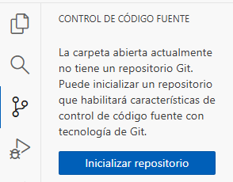

En la pestaña de git registrará todos los archivos del proyecto, ponemos un mensaje, le damos a **confirmación** y si. Con esto se crea la rama main automáticamente y nos sale el boton **Publicar Branch** que sirve para subir la rama a GitHub.

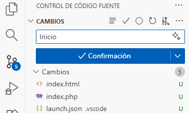

Como es la primera vez que vamos a subir la rama no hay un proyecto ni tenemos la cuenta de GitHub configurada. Le damos al boton y nos saldrá una ventana para que pongamos el usuario y contraseña de GitHub, después nos saldrán dos opciones para crear el proyecto publico o privado. 

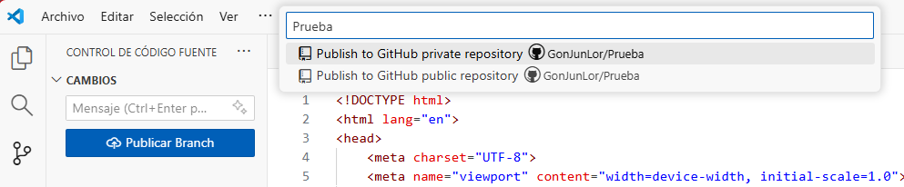

En mi caso eligo público y ya nos crea el proyecto en GitHub y nos sale una ventana para abrirlo.

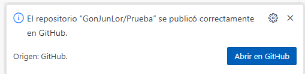


#### <h2>*.gitignore*</h2>
Es un archivo que sirve para indicarle a git que archivos y carpetas no queremos que se haga seguimiento ni se suban a GitHub. Lo creamos con el nombre .gitignore y escribimos dentro esos archivos y carpetas. Al observar el explorador de archivos vemos que se ponen en gris lo que indica que se está teniendo en cuenta el .gitignore.

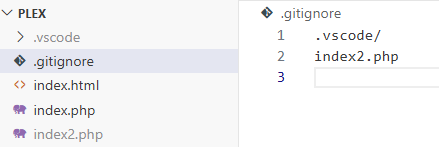

Este archivo tiene que estar en la raíz del proyecto. 

#### <h2>*Clonar repositorio*</h2>
En el caso de que ya tengamos un repositorio en GitHub y queramos usarlo en un ordenador nuevo.

Lo primero es ir a a GitHub al repositorio y copiar la url desde ahí

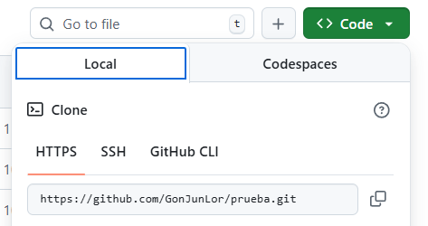

Luego en una ventana nueva de VSCode damos F1 y buscamos *Git: Clonar*

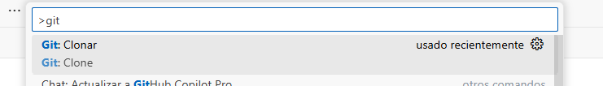

Pegamos la url del repositorio y le damos a intro.

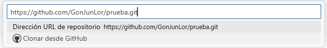

Se nos abrirá una ventana para elegir donde guardamos el proyecto que estamos clonando. Una vez que acabe nos pedirá si queremos abrirlo.

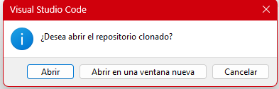

Ya podemos trabajar normalmente con este proyecto.

#### <h2>*Uso de ramas.*</h2>
Le damos en la parte de abajo donde está el nombre de la rama activa


Nos saldrá una ventana con opciones para crear una nueva rama, cambiar de ramas entre las que tenemos en local o cambiar por una que tenemos en GitHub.

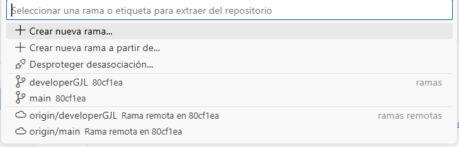

Hay que tener en cuenta que cuando elegimos una rama que está en GitHub y no la tenemos en local lo que hace es crear una copia en local y ponernos esa activa.

**<h3>Fusionar ramas (Merge)</h3>**
Normalmente se hace para unir la rama de desarrollo con la principal. VSCode tiene una opcion para unir ramas que podemos acceder así

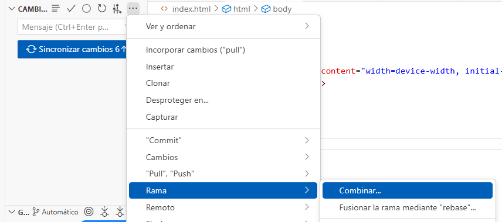

Lo malo de esta forma es que une a la rama principal todos los commit que tengamos en la rama developer y no queremos eso, sino que se una sólo el útimo en ese momento.

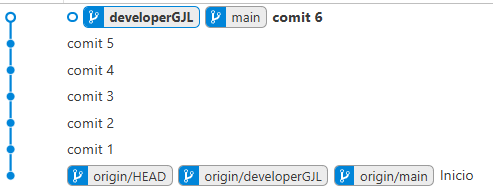

Para hacer bien la fusion vamos a usar la extension [Git Graph](https://marketplace.visualstudio.com/items?itemName=mhutchie.git-graph). 

Partimos de que siempre estamos desarrollando en la rama de desarrollo.

El proceso para hacer la fusion consiste en cambiarnos a la rama master, abrir la extensión Git Graph 
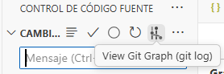
seleccionar con el boton derecho la rama de desarrollo y darle a merge.

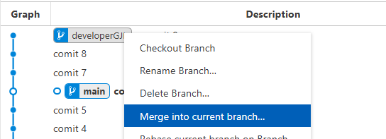

En la nueva ventana le damos a *Yes, merge* según está.
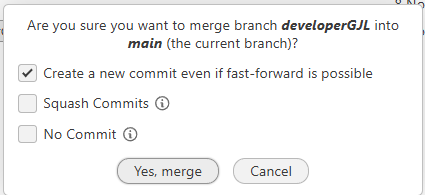

Después volvemos a cambiar a la rama de desarrollo, damos botón derecho sobre la rama principal y merge de nuevo. En este caso desmarcamos la primera opción y le damos a *Yes, merge*.

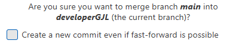

De esta forma se une a la rama principal solo el commit 9 en este caso, pero el commit 7 y 8 se quedan en la de desarrollo que aqui es la rosa. Vemos como tanto la rama principal como la de desarrollo estan en el mismo punto.

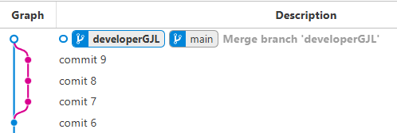

En cualquier momento le damos a Sincronizar cambios para que se suban los cambios de esa rama a GitHub.
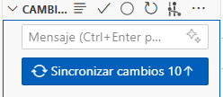


### <h2>**Ejemplo de uso**</h2>

#### <h2>*Añadir a staged y commit.*</h2>
Cuando hacemos cualquier modificación en nuestros archivos aparecen los archivos en la zona de cambios, si queremos poner todos los cambios en el mismo commit ponemos un mensaje, le damos a confirmación y despues a si, esto lo que hace es pasar todo al staged y hacer el commit. También podemos darle al más para añadir manualmente todos los archivos al staged y luego a confirmación.


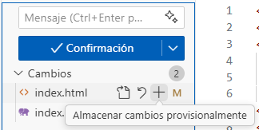
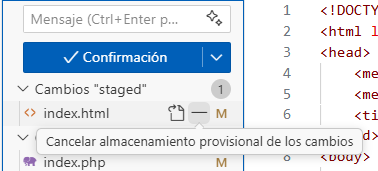

Cuando queremos hacer un commit solo de algunos archivo podemos añadir al staged solo los que queramos con el más sobre él, de la misma forma podemos quitarlos del staged con el menos.

#### <h2>*Remover archivo del seguimiento de git.*</h2> 

git rm elimina un archivo tanto del directorio de trabajo como del área de preparación de Git, marcando su eliminación para el próximo commit. Este comando combina la eliminación del archivo con git add para que los cambios se preparen y se registren en el historial. Para solo eliminar un archivo del seguimiento de Git sin borrarlo del disco, se puede usar la opción --cached. 

Uso básico 

>git rm <nombre_archivo>: Elimina un archivo de tu proyecto y lo marca para ser eliminado en el siguiente commit.

>git rm <archivo1> <archivo2>: Elimina varios archivos a la vez.

>git rm -r <nombre_directorio>: Elimina un directorio completo y todo su contenido. 

Opciones útiles 

> --cached: Elimina el archivo del índice (área de preparación) pero lo conserva en tu directorio de trabajo. Esto hace que Git deje de rastrear el archivo, pero sigue estando en tu disco.

> --force o -f: Fuerza la eliminación incluso si hay cambios no guardados en el archivo. Se usa con precaución para evitar la pérdida de datos.

#### <h2>*Borrar proyecto y/o seguimiento.*</h2> 
Para borrar el proyecto entero vamos en el explorador de archivos de windows a la carpeta del proyecto y al borramos.

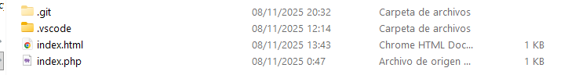

En caso de que solo queramos quitar el seguimiento de git lo que hacemos es borrar la carpeta .git.

>Para mostrarla en caso de que no se vea, en windows 11, vamos a el menu superior y damos a ver/mostrar/elementos ocultos.


## <h1>GitHub</h1>
En este apartado nos centramos en qué podemos hacer desde la web de GitHub y también las cosas que hacemos en local pero que están orientadas a compartir proyectos en GitHub como las etiquetas y releases, etc.

#### <h2>*Borrar proyecto.*</h2> 
Para borrar un proyecto en GitHub, nos vamos nuestro proyecto y le damos a settings.

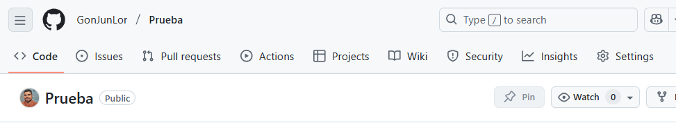

Bajamos hasta abajo del todo y damos a delete this repository.

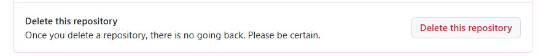

Nos preguntará si queremos borrarlo.

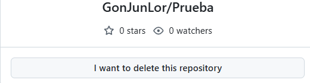

Volvera a salir un aviso para tengamos en cuenta que no hay vuelta a atrás.

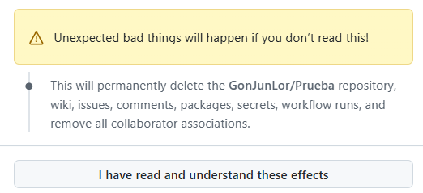

En la siguiente ventana nos dira que pongamos nuestro nombre y el del repositorio.
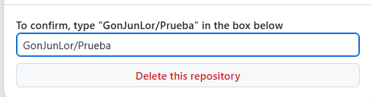

La siguiente es para confirmar que somos nosotros, en este paso si tenemos habilitado la doble autentificación pondremos el codigo de nuestra app de generación de codigos (en mi caso [Google Authenticator](https://play.google.com/store/apps/details?id=com.google.android.apps.authenticator2&hl=es)). Si no lo tenemos habilitado pondremos la contraseña de GitHub.

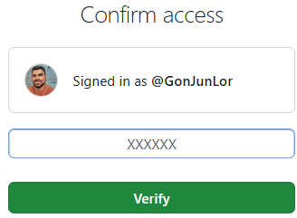

Una vez que le hemos dado a *verify* no reenvia a la pagina principal con el mensaje de confirmación de borrado.

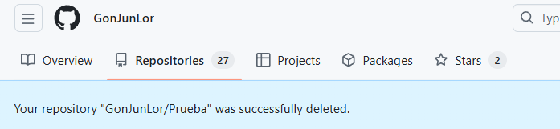

#### <h2>*Lanzamientos (Releases).*</h2> 

> **Gonzalo Junquera Lorenzo**  
> Curso: 2025/2026  
> 2º Curso CFGS Desarrollo de Aplicaciones Web  

