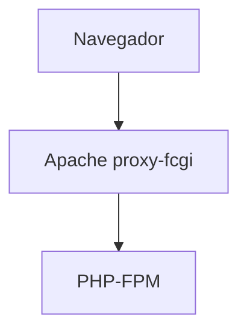

<!-- title: README -->
# CFGS Desarrollo de Aplicaciones Web

|  CFGS DESARROLLO  DE APLICACIONES WEB |
|:-----------:|
||
| DESPLIEGUE DE APLICACIONES WEB
| CYBERSEGURIDAD
| DAWES Tema 2. INSTALACIÓN, CONFIGURACIÓN Y DOCUMENTACIÓN DE ENTORNO DE DESARROLLO Y DEL ENTORNO DE EXPLOTACIÓN |


- [CFGS Desarrollo de Aplicaciones Web](#cfgs-desarrollo-de-aplicaciones-web)
  - [1. Entorno de Desarrollo](#1-entorno-de-desarrollo)
    - [1.1 Ubuntu Server 24.04.3 LTS](#11-ubuntu-server-24043-lts)
      - [1.1.1 **Configuración inicial**](#111-configuración-inicial)
        - [**Comprobaciones sistema operativo**](#comprobaciones-sistema-operativo)
        - [**Cambiar nombre servidor**](#cambiar-nombre-servidor)
        - [**Actualizar el sistema**](#actualizar-el-sistema)
        - [**Configuración fecha y hora**](#configuración-fecha-y-hora)
        - [**Antivirus**](#antivirus)
        - [**Cuentas administradoras**](#cuentas-administradoras)
        - [**Habilitar cortafuegos**](#habilitar-cortafuegos)
        - [**Conexión al servidor desde windows**](#conexión-al-servidor-desde-windows)
        - [**Comprobar ip, puerta de enlace y dns**](#comprobar-ip-puerta-de-enlace-y-dns)
        - [**Particiones**](#particiones)
        - [**Actualización**](#actualización)
      - [1.1.2 Instalación del servidor web](#112-instalación-del-servidor-web)
        - [Instalación](#instalación)
        - [Configuración](#configuración)
        - [Monitorización](#monitorización)
        - [Mantenimiento](#mantenimiento)
        - [Verficación del servicio](#verficación-del-servicio)
        - [Virtual Hosts](#virtual-hosts)
        - [Archivos de configuración](#archivos-de-configuración)
        - [Errores con htaccess](#errores-con-htaccess)
      - [1.1.3 PHP](#113-php)
        - [Instalación](#instalación-1)
        - [Configuración](#configuración-1)
        - [Monitorización](#monitorización-1)
        - [Mantenimiento](#mantenimiento-1)
      - [1.1.4 MySQL](#114-mysql)
        - [Instalación](#instalación-2)
        - [Configuración](#configuración-2)
        - [Monitorización](#monitorización-2)
        - [Mantenimiento](#mantenimiento-2)
      - [1.1.5 XDebug](#115-xdebug)
        - [Instalación](#instalación-3)
        - [Configuración](#configuración-3)
        - [Monitorización](#monitorización-3)
        - [Mantenimiento](#mantenimiento-3)
      - [1.1.6 Servidor web seguro (HTTPS)](#116-servidor-web-seguro-https)
      - [1.1.7 DNS](#117-dns)
      - [1.1.8 SFTP](#118-sftp)
      - [1.1.9 Apache Tomcat](#119-apache-tomcat)
      - [1.1.10 LDAP](#1110-ldap)
    - [1.2 Windows 11/10](#12-windows-1110)
      - [1.2.1 **Configuración inicial**](#121-configuración-inicial)
        - [**Nombre y configuración de red**](#nombre-y-configuración-de-red)
        - [**Cuentas administradoras**](#cuentas-administradoras-1)
      - [1.2.2 **Navegadores**](#122-navegadores)
      - [1.2.3 **MobaXterm**](#123-mobaxterm)
      - [1.2.4 **Netbeans**](#124-netbeans)
        - [Instalación](#instalación-4)
        - [Configuración](#configuración-4)
        - [Ejemplo de uso](#ejemplo-de-uso)
      - [Crear proyecto con conexion (SFTP) al servidor](#crear-proyecto-con-conexion-sftp-al-servidor)
      - [Borrar proyecto con conexion (SFTP) al servidor](#borrar-proyecto-con-conexion-sftp-al-servidor)
      - [1.2.5 **Visual Studio Code**](#125-visual-studio-code)
  - [2. GitHub](#2-github)
  - [3.Entorno de Explotación](#3entorno-de-explotación)

## 1. Entorno de Desarrollo

### 1.1 Ubuntu Server 24.04.3 LTS

Este documento es una guía detallada del proceso de instalación y configuración de un servidor de aplicaciones en Ubuntu Server utilizando Apache, con soporte PHP y MySQL

#### 1.1.1 **Configuración inicial**

##### **Comprobaciones sistema operativo**
- Tipo de sistema operativo
````
uname -a
````
- Ver procesos
````
ps -ef
````

- Nombre y configuración de red

> **Nombre de la máquina**: gjl-uslimpia\
> **Memoria RAM**: 2G\
> **Particiones**: 150G(/) y resto (/var)\
> **Configuración de red interface**: enp0s3 \
> **Dirección IP** :10.199.8.153/22\
> **GW**: 10.199.8.1/22\
> **DNS**: 10.151.123.21 10.151.126.21

* Creamos una copia del archivo que viene por defecto 50-cloud-init.yml
````
cd /etc/netplan
sudo cp 50-cloud-init.yml enp0s3.yaml
````
- Editar el fichero de configuración del interface de red  **/etc/netplan/enp0s3.yaml**

```bash

# This is the network config written by 'subiquity'
network:
  ethernets:
    enp0s3:
      addresses:
       - 10.199.8.153/22
      nameservers:
         addresses:
         - 10.151.123.21
         - 10.151.126.21
      search: [educa.jcyl.es]
      routes:
        - to: default
           via: 10.199.8.1   
  version: 2
````
- Actualizar la configuración de red
````
sudo netplan apply
````
##### **Cambiar nombre servidor**
````
sudo hostnamectl set-hostname gjl-used
````
- También cambiamos el nombre en ese archivo y comprobamos con cat
````
sudo nano /etc/hosts
cat /etc/hosts
````

##### **Actualizar el sistema**

```bash
sudo apt update
sudo apt upgrade
```

##### **Configuración fecha y hora**

[Establecer fecha, hora y zona horaria](https://somebooks.es/establecer-la-fecha-hora-y-zona-horaria-en-la-terminal-de-ubuntu-20-04-lts/ "Cambiar fecha y hora")
````
sudo timedatectl set-timezone Europe/Madrid
````
##### **Antivirus**
````
sudo apt install clamav
````
##### **Cuentas administradoras**

> - [X] root(inicio)
> - [X] miadmin/paso
> - [X] miadmin2/paso

* Para crear el usuario miadmin2 como administrador en los mismos grupos que miadmin, miadmin está creado al instalar ubuntu server. Después le ponemos una contraseña
````
sudo useradd -m -G sudo,adm,cdrom,dip,plugdev,lxd -s /bin/bash miadmin2
sudo passwd miadmin2
````
* Para borrar un usuario
````
sudo userdel miadmin2
````
* Para ver datos de las cuentas
````
cat /etc/passwd
cat /etc/group
````
##### **Habilitar cortafuegos**

- Activar cortafuegos
````
sudo ufw enable
````
- Abrir puerto 22
````
sudo ufw allow 22
````
- Ver puertos abiertos, cualquiera de los dos comandos.
````
sudo ufw status
sudo ufw status numbered 
````
- Quitar número de puerto
````
sudo ufw delete [numPuerto]
````
##### **Conexión al servidor desde windows**
* Arrancamos el servicio ssh en el servidor
````
sudo systemctl start ssh
````
* Comprobamos que esta en active (running)
````
sudo systemctl status ssh
````
* Abrimos la consola de windows (simbolo del sistema): usamos el comando ssh con nuestro nombre de usuario y ip del servidor, despues nos pedirá la clave.
````
ssh miadmin@10.10.199.8.153
````

##### **Comprobar ip, puerta de enlace y dns**
* Para ver la ip, el nombre de nuestro adaptador de red (enp0s3), si es dinámica pondra dynamic en la misma linea, si es estática no pondrá nada.
````
ip a
````
* Para ver la puerta de enlace, en la primera linea pone la puerta de enlace y tambien el nombre de la tarjeta de red
````
ip r
````
* Para ver los dns, en DNS Servers se ve cuales hay configurados, tambien vemos a que dominio pertenecemos en DNS Domain
````
resolvectl
````
##### **Particiones**
* Con ambos comandos vemos que particiones hay y de que tamaño son. El primero da mas información del tamaño usado.
````
df -h
lsblk [-a][-fm][-fn]
fdisk -l
````
##### **Actualización**
* Para comprobar si hay actualizaciones y despues que actualice todo lo necesario
````
sudo apt update
sudo apt upgrade
````

#### 1.1.2 Instalación del servidor web

##### Instalación
- Instalamos apache
````
sudo apt update
sudo apt install apache2
````
- Abrir puerto 80, comprobamos y desactivamos el 80(v6)
````
sudo ufw allow 80
sudo ufw status numbered
sudo ufw delete 3
````
##### Configuración
**Permisos y usuarios**
- Creamos usuario del dominio para administrar la web.
  - Nombre: operadorweb/paso
  - directorio de trabajo: /var/www/html 
  - grupo:www-data
  - shell:/bin/bash
  - 
````
sudo useradd -M -d /var/www/html -N -g www-data -s /bin/bash operadorweb
````
- Cambiamos la contraseña (paso)
````
sudo passwd operadorweb
````
- Cambiamos el propietario de la carpeta html y el grupo
````
sudo chown -R operadorweb:www-data /var/www/html
````
- Cambiamos los permisos de la carpeta html
````
sudo chmod -R 775 /var/www/html
````


##### Monitorización
- Comprobamos que el servicio esta en ejecucion (running)
````
sudo systemctl status apache2
````
- Comprobamos ubicacion de la carpeta y los archivos web
````
cd /var/www/html
ls
````
##### Mantenimiento


##### Verficación del servicio


##### Virtual Hosts

##### Archivos de configuración
Estan en etc/apache2/
* Redirección de errores a archivo error.log, añadimos la línea CustomLog al archivo 000-default.conf. Previamente hay que tener creada la carpeta error en /var/www/html/
````
sudo nano sites-available/000-default.conf
CustomLog ${APACHE_LOG_DIR}/access.log combined
````
* Quitar aviso al usar el comando apache2ctl configtest.

* añadimos el nombre del servidor al final del archivo de configuración apache2.conf
````
sudo nano /etc/apache2/apache2.conf
ServerName gjl-used
````
* Para poder poner directivas solo a nuestra web lo hacemos con un archivo .htaccess, pero para poder usar este archivo primero tenemos que cambiar la configuracion de apache2.conf

##### Errores con htaccess
Al lado del index general de nuestra aplicación creamos el archivo .htaccess el cual manejará los errores 500, 404 y 403.
* Inicialmente podemos configurar un mensaje de error en este mismo archivo añadiendo esta línea.
````
ErrorDocument 404 "Mensaje de error"
````
* Mejor se hace con enlaces a paginas html de errores que estan en la carpeta error. De momento usamos rutas absolutas desde la raiz de nuestro servidor
````
ErrorDocument 404 /GJLDWESProyectoDWES/error/404.html
ErrorDocument 403 /GJLDWESProyectoDWES/error/403.html
ErrorDocument 500 /GJLDWESProyectoDWES/error/500.html
````

#### 1.1.3 PHP
##### Instalación
````
sudo apt install php8.3-fpm php8.3
````
##### Configuración
**Ficheros de configuración de PHP para php-fpm:**
* **/etc/php/8.3/fpm/conf.d**: Módulos instalados en esta configuración de php (enlaces simbólicos a /etc/php/8.3/mods-available)
* **/etc/php/8.3/fpm/php-fpm.conf** : Configuración general de php-fpm
* **/etc/php/8.3/fpm/php.ini** : Configuraicón de php para este escenario
* **/etc/php/8.3/fpm/pool.d** : Directorio con distintos pool de configuración. Cada aplicación puede tener una configuración distinta (procesos distintos) de php-fpm.

Por defecto tenemos un pool cuya configuración la encontramos en **/etc/php/8.3/fpm/pool.d/ www.conf**, en este fichero podemos configurar parámetros, los más importantes son:

* **[www]**: -es el nombre del pool, si tenemos varios, cada uno tiene que tener un nombre.
* ** user y group** : Usuario y grupo con el que va a ejecutar los procesos
* **listen**: Se indica el socket unix o el socket TCP donde se van a escuchar los procesos:
  * Por defecto, escucha por un socket unix: listen=/run/php/php8.3-fpm.sock
  * Si queremos que escuche por TCO; listen=127.0.0.1:9000
* Directivas de procesamiento, gestión de procesos:
  * **pm**: Por defecto es igual a dynamic (el número de procesos se crean y se destruyen de forma dinámica). Otros valores: static o ondemand.
  * Otras directivas: **pm.max_children** (número máxio de procesos hijo que pueden ser creados al mismo tiempo para manejar solicitudes), **pm.start_servers** (cuantos procesos PHP-FPM se lanzararón al inicio de forma automática),**pm.min_spare_servers**( número mínimo de procesos del servidor inactivos para manejar nuevas solicitudes),...
  * **pm.status_path=/status**: No es necesario, vamos a activar la URL de status para comprobar el estado del proceso.

Reiniciar el servicio:
```bash
sudo systemctl restart php8.3-fpm
```

Configuración de Apache2 con PHP-FPM


Apache2 va a funcionar como proxy inverso(reverse proxy) para las peticiones de los recursos php. cuando solicitamos un fichero php, apache2 le pasará la petición a php-fpm para que interprete el php y luego devuelva la respuesta al servidor web.



```bash
sudo a2enmod proxy_fcgi setenvif
```


**Activarlo para cada virtualhost**

Un **socket** es un "canal de comunicación* entre dos procesos, en nuestro caso es entre el programa Apache con PHP-FPM.

Se pueden usar dos tipos de SOCKET:

* Si php-fpm está escuchando en un SOCKET TCP

Usa una dirección IP y un puerto para comunicarse, por lo tanto usa el protocolo TCP/IP (comunicación en red) y puede conectarse desde otra máquina si el puerto está abierto.
  
```bash
  ProxyPassMatch ^/(.*\.php)$ fcgi://127.0.0.1:9000/var/www/html/$1
```

- La directiva `ProxyPassMatch`Indica a Apache que use un sistema proxy con una expresión regular para indicar qué peticiones redirigir.

- `^/(.*\.php)` Es la expresión regular que cpatura cualquier URL que termina en .php y el contenido del parentesis se guarda en $1. Por ejemplo: /index.php, /blog/post.php,etc
-  `fcgi://127.0.0.1:9000/var/www/html/$1` define el destino FastCGI donde enviará las peticiones:
   -  fcgi:// usa el protocolo FastCGI
   -  127.0.0.1:9000 dirección y puerto donde PHP-FPM está escuchando
   -  /var/www/html/$1 ruta real del archivo PHP en el servidor (Apache sustituye $1 por el nombre del archivo)

* Si php-fpm está escuchando en un  SOCKET UNIX (local)
  
Existe un **archivo especial** en `/run/php/php8.3-fpm.sock`que actua como punto de comunicación dentro de la propia máquina en sistemas UNIX/Linux y no usa puertos ni direcciones IP.
 
 Se pone esta expresion en el archivo /etc/apache2/sites-available/000-default.conf
```bash
  ProxyPassMatch ^/(.*\.php)$ unix:/run/php/php8.3-fpm.sock|fcgi://127.0.0.1/var/www/html
```


Otra forma de hacerlo:

* Si php-fpm está escuchando en un socket TCP
  La directiva `SetHandler` indica qué manejador debe usarse para procesar las solicitudes de ciertos archivos.
  En este caso los archivos PHP, los envía al proxy FastCGI
  
```bash
<FilesMatch "\.php$">
  	SetHandler "proxy:fcgi://127.0.0.1:9000"
  </FilesMatch>
```

* Si php-fpm está escuchado en un socket UNIX

```bash
  <FilesMatch "\.php$">
 	  SetHandler "proxy:unix:/run/php/php8.2-fpm.sock|fcgi://127.0.0.1/"
  </FilesMatch>
```

**Activarlo para todos los virtualhost**
El fichero de configuraicón `php8.3-fpm`en el directorio `/etc/apache2/conf-available`, por defecto funciona cuando php-fpm está escuchando en un socket UNIX:

```bash
<FilesMatch ".+\.ph(?:ar|p|tml)$">
    SetHandler "proxy:unix:/run/php/php8.3-fpm.sock|fcgi://localhost"
</FilesMatch>
```

`<FilesMatch ".+\.ph(?:ar|p|tml)$"> ` Aplica esta configuración solo a archivos cuyo nombre coincida con esa expresión regular:

.+\.phar

.+\.php

.+\.phtml

Es decir: a cualquier archivo PHP o variantes (.phar, .php, .phtml).

`SetHandler "proxy:unix:/run/php/php8.3-fpm.sock|fcgi://localhost"`

Esta es la línea clave.

* `SetHandler`  define cómo Apache debe procesar esos archivos.

* `proxy` usa el módulo de Apache llamado mod_proxy.

* `unix:/run/php/php8.3-fpm.sock ` indica que la comunicación con PHP-FPM será a través de un socket UNIX local (no TCP).

* `|fcgi://localhost ` especifica el protocolo FastCGI, y que el destino lógico (nombre del backend) es “localhost”.
  
Por último activamos (o comprobar que esta activado):

```bash
sudo a2enconf php8.3-fpm
```

Comprobación de funcionamiento PHP-FPM


PHP-FPM puede escuchar por socket UNIX o TCP/IP (host:puerto). Revisar cada "pool" en Ubuntu en `/etc/php/8.3/fpm/pool.d/www.conf`

```bash
grep '^listen' /etc/php/8.3/fpm/pool.d/*.conf
```

Dos posibles resultados:

```bash
listen = /run/php/php8.3-fpm.sock

```

Esta escuchando en socket UNIX

```bash
listen = 127.0.0.1:9000
```

Está escuchando por TCP/IP en la dirección local

- Configuramos el php.ini para un entorno de desarrollo, primero hacemos copia del archivo. 
````
cd /etc/php/8.3/fpm/
sudo cp php.ini php.ini.bk20251007
sudo nano php.ini
````
- php-fpm.conf como configurar

- Editamos el archivo php.ini (con ctrl+w buscamos) y cambiamos tres cosas


- Reiniciamos el servicio php y comprobamos que esta running
````
sudo systemctl restart php8.3-fpm.service
sudo systemctl status php8.3-fpm.service
````
- con el comando phpinfo(); comprobamos que se han habilitado los cambios 


- para ver los modulos activos, concretamente interesa el mpm_XXX
````
apache2ctl -M
````
##### Monitorización

##### Mantenimiento

#### 1.1.4 MySQL
##### Instalación
##### Configuración
##### Monitorización
##### Mantenimiento

#### 1.1.5 XDebug
##### Instalación
Primero, actualiza la lista de paquetes y luego instala el paquete específico para PHP 8.3:
````
sudo apt update
sudo apt install php8.3-xdebug
````
Habilitamos el servicio
````
sudo phpenmod xdebug
````
##### Configuración
Puerto 9003, 
Abrimos el archivo:
````
sudo nano /etc/php/8.3/mods-available/xdebug.ini
````
Modificamos el archivo para configurar el modo depuración.
* Por defecto
````
zend_extension=xdebug.so
````
* Xdebug 2
````
xdebug.remote_enable=on
xdebug.remote_handler=dbgp
xdebug.client_port=localhost
xdebug.remote_port=9003
xdebug.idekey="netbeans-xdebug"
````
* Xdebug 3
````
xdebug.mode=debug
xdebug.client_host=localhost
xdebug.client_port=9003
xdebug.idekey="netbeans-xdebug"
````
Reiniciamos todos los servicios y habilitamos xdebug
````
sudo systemctl restart php8.3-fpm.service
sudo systemctl restart apache2
````
##### Monitorización
Desde el navegador podemos ver la sección de xdebug en phpinfo.
Creamos una pagina info.php en la raiz de nuestro servidor con la la siguiente linea y la abrimos con el navegador
````
<?php phpinfo(); ?>
````

##### Mantenimiento

#### 1.1.6 Servidor web seguro (HTTPS)
* Creamos los certificados y configuramos los datos
````
sudo openssl req -x509 -nodes -days 365 -newkey rsa:2048 -keyout /etc/ssl/private/gjl-used.key -out /etc/ssl/certs/gjl-used.crt
````


* Comprobamos que se han creado
````
sudo ls -l /etc/ssl/certs/ | grep gjl-used
sudo ls -l /etc/ssl/private/ | grep gjl-used
````

* Activamos ssl
````
sudo a2enmod ssl
````
* Copiar el fichero default-ssl.conf a gjl-used.conf
````
cd /etc/apache2/sites-available/
sudo cp default-ssl.conf gjl-used.conf 
````
* Modificar el fichero. Indicar donde está el certificado. Poniendo los nombre nuevos gjl-used.crt y .key
````
sudo nano gjl-used.conf
````

* Activar sitio
````
sudo a2ensite gjl-used.conf
````
* Abrir el puerto 443
````
sudo ufw allow 443
````

#### 1.1.7 DNS
#### 1.1.8 SFTP

#### 1.1.9 Apache Tomcat
#### 1.1.10 LDAP

### 1.2 Windows 11/10
#### 1.2.1 **Configuración inicial**
##### **Nombre y configuración de red**
##### **Cuentas administradoras**
#### 1.2.2 **Navegadores**
#### 1.2.3 **MobaXterm**
- ver la parte del servidor y local con el otro programa
#### 1.2.4 **Netbeans**
##### Instalación
Apache NetBeans IDE 20

##### Configuración
##### Ejemplo de uso
- version y plugins de netbeans
- como usar github
- como llevar a casa y volver a usar aquí
- capturas solo de la parte ineteresada, no de toda la pantalla
#### Crear proyecto con conexion (SFTP) al servidor
- Nuevo proyecto PHP marcando la opción "PHP Application from Remote Server"

- Ponemos nombre de proyecto y cambiamos la ruta por la nuestra personal

- Configuramos la url con nuestro servidor y el nombre del proyecto en el servidor, en el caso del proyecto principal no tiene carpeta es la raíz (/)

- La primera vez que creamos un proyecto con conexión al servidor hay que configurarlo con nombre de usuario, contraseña y directorio inicial

- Si todo ha ido bien se conectará al servidor y entrará en la carpeta del proyecto que previamente tenemos que haber creado y que haya por lo menos un archivo en ella. Aquí ya marcamos para que se bajen los archivos que queramos.


#### Borrar proyecto con conexion (SFTP) al servidor
- botón secundario sobre el proyecto y delete. Nos pedirá confirmación y si queremos que borre los archivos en nuestro ordenador. Los del servidor lo tenemos que borrar a mano.


#### 1.2.5 **Visual Studio Code**

## 2. GitHub
Configuracion global en local
Abrimos git bash y configuramos nuestro email y nuestro nombre
````
git config --global user.name "Tu Nombre Completo"
git config --global user.email "tu.email@ejemplo.com"
````
## 3.Entorno de Explotación

---

> **Gonzalo Junquera Lorenzo**  
> Curso: 2025/2026  
> 2º Curso CFGS Desarrollo de Aplicaciones Web  

